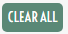

# Pixel-Art-Maker

This project was built for the Front-End Nanodegree, in Udacity. 

## Instructions: 

To use correctly Pixel Art Maker, first choose the size you want, be aware that the maximum it's only  50x50

and click on submit button;

Then, choose the color you want by clicking on this rectangle: 

this rectangle will open a window, where you can pick a color

and feel free to design whatever you want to 

if, for some reason you want to delete, just a single cell, please doubleclick on the cell you want to delete, but if you want to delete all your work, click: 

## Version

V1.0 

## Problems

If you have problems working with this, please feel free to contact me, with the screenshot of the problem, and what happened.

## Contributing
This is not an open-source project or a contributive one.

## License

GNU General Public License v3.0